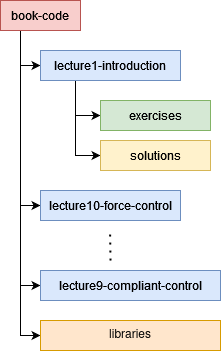

# "Learning for Adaptive and Reactive Robot Control" Code
We provide here Matlab Code for each of the course's lectures. This repository is composed of exercises adapted from the book for each lecture, with instructions and code ready to be completed by students. Instructors may request solutions to the programming and pen and paper exercises on the [MIT Press website](https://mitpress.mit.edu/9780262046169/) by clicking on "Digital Exam/Desk Copy" and choosing supplementary materials afterwards.

The code provided here is sorted by lecture, where each exercise session follows its corresponding lecture and is meant to last 2 hours, with 1h of theoretical exercises and 1h of programming exercises. The correspondence between book chapters and lectures is available [here](https://www.epfl.ch/labs/lasa/mit-press-book-learning/#mit-book-table).

The practicals are 4 hours long sessions of programming exercises which replace lectures 5, 8 and 11 respectively. Practical 3 is meant to be run with Franka Emika Panda robots in the lab. 

## *Installation*
You will need a version of Matlab from 2019 or higher with the following toolboxes :
- Control System
- Curve Fitting
- Deep Learning
- Image Processing 
- Model Predictive Control
- Optimization
- Robotic System
- ROS 
- Signal Processing
- Statistics and Machine Learning

#### Warning for Mac Users ####

Exercises in lecture 4 and practical 1 require additional setup on Mac. 
Instructions for this are available in the 'mac_setup' directory in the lecture 4 folder. 

## *Architecture* 

The solutions folders obtained by students through Moodle should be unzipped and placed in their respective lecture directory, adjoint to the exercises directory, as shown in the diagram below.

